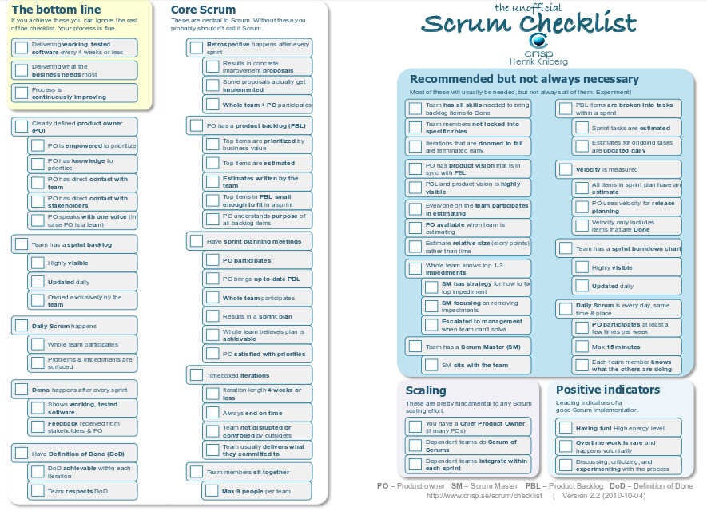

# 21 Retrospectiva del día 3

Realizar retrospectivas de la misma manera durante un largo tiempo, puede afectar la mejora (que es el propósito principal de una retrospectiva), ya que se deja de aprender. Una manera de seguir aprendiendo y la retrospectiva cumpla su objetivo es aplicando maneras diferentes de realizar retrospectivas, por ejemplo: “The Joel Test”.

__The Joel Test__

Joel Spolsky describe 12 preguntas para identificar si una empresa de desarrollo para identificar si se esta desarrollando código de calidad.
Con estas preguntas es facíl de identificar si se esta desarrollando buen código, cada pregunta vale un punto, si la respuesta es "si", se realiza la suma de los puntos e indentificara que tan bueno o malo esta desarrolando código una empresa. Según Joel, 12 es perfecto, 11 es tolerable, pero 10 indica que tiene serios problemas.

1. Do you use source control?

2. Can you make a build in one step?

3. Do you make daily builds?

4. Do you have a bug database?

5. Do you fix bugs before writing new code?

6. Do you have an up-to-date schedule?

7. Do you have a spec for requirements?

8. Do programmers have quiet working conditions?

9. Do you use the best tools money can buy?

10. Do you have testers?

11. Do new candidates write code during their interview?

12. Do you do hallway usability testing?

Por lo tanto, si se es dueño de una empresa o como buen emprendedor pretende iniciar con una empresa de desarrollo debera tomar en cuanta que las empresas que desarrollan con la mejor calidad, tienen una puntacion de 12 como Microsoft, pero en general las empresas en México según los resultados de la aplicacion de este test a alumnos de la maestria en Ingenieria de Software (CIMAT) impartida en Zacatecas arrojaron que las empresas en las que han trabajado o realizado estadias o residencia profesional, calificaron a la empresa con un promedio de entre 4 y 6.

Se sabe que estos aspectos no determinan si una empresa es exitosa o no, pero cumplir con estas doce preguntas, sin duda alguna le ayudaran a formar un equipo de trabajo con disciplina y que genere Software de calidad.

Link Joel Test [aquí][11.1]

[11.1]: http://www.joelonsoftware.com/articles/fog0000000043.html

Otra manera de realizar las retrospectivas es aplicando el Check-list que sugiere SCRUM. Es una lista de preguntas específicas, las cuales se van marcado si el equipo de trabajo está cumpliendo con esa tarea o actividad, en caso contrario, son las preguntas que se toman en cuenta para realizar la mejora y establecer los compromisos.

Link del Check-list: [aquí][11] 

[11]:https://www.crisp.se/wp-content/uploads/2012/05/Scrum-checklist.pdf

